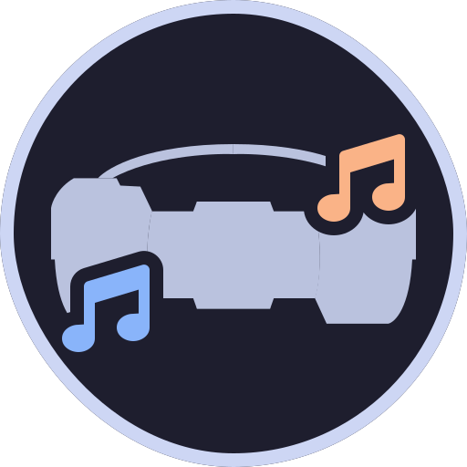
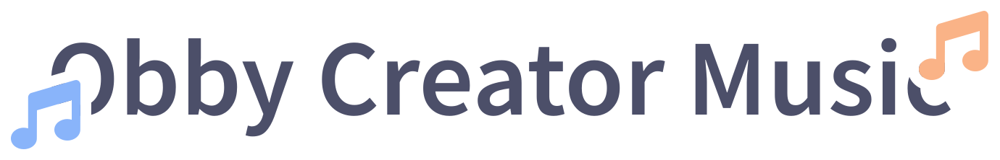

    <h3>
     
    <picture>
        <source media="(prefers-color-scheme: dark)" srcset="../assets/title-dark.svg">
        
    </picture> 
    <h6 align="center">
      <a href="https://discord.gg/K4gFUPTA7B">Discord</a>
      &nbsp;·&nbsp;
      <a href="https://twitter.com/ocmusic_real">Twitter</a>
      &nbsp;·&nbsp;
      <a href="https://bento.me/ocm">Bento</a>
    </h6>
    
    </h3>
    
We are a Roblox group implementing custom music to UGC based games like Obby Creator which otherwise may have stayed silent. Before our group was falsely terminated, we had over 50k group members and over 10k audios. 

### Highlights

**OCMusic Audio Browser**
A custom audio browser for browsing and listen to audios uploaded in our now terminated, Roblox group. The browser still works, which you can visit it below:

    <a href="https://www.roblox.com/games/9937132110/OCM-Song-Browser">
        
    <a/>
    &nbsp;
    

